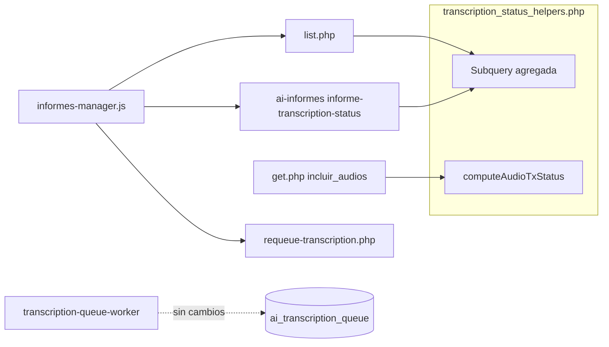

# Estado de transcripción en Informes Manager

Implementación técnica de alertas TX en la grilla y modal de **informes-manager** (2026-09-02).

---

## Objetivo

Exponer en **Informes Manager** el estado de transcripción de audios por informe, reutilizando criterios ya usados en AI Informes y Audit Manager, sin modificar worker ni esquema de BD.

---

## Archivos modificados / creados

| Archivo | Tipo | Descripción |
|---------|------|-------------|
| `api/informes/transcription_status_helpers.php` | **Nuevo** | Lógica SQL y PHP compartida de estado TX |
| `api/informes/list.php` | Modificado | JOIN subquery + campos `audios_tx_*` |
| `api/ai-informes.php` | Modificado | Action `informe-transcription-status` |
| `api/informes/get.php` | Modificado | Campos TX por audio con `incluir_audios=1` |
| `api/audios/requeue-transcription.php` | **Nuevo** | Reencolado con sesión estándar (no requiere rol auditor) |
| `assets/js/informes-manager.js` | Modificado | Badges, polling, modal, reintentar |
| `components/informes-manager.html` | Modificado | Cache bust JS (`?v=202609021200`) |

---

## Campos agregados en API list (`list.php`)

Por cada informe en la respuesta JSON:

| Campo | Tipo | Descripción |
|-------|------|-------------|
| `audios_transcribed` | int | Audios con transcripción completada |
| `audios_tx_pending` | int | En cola, aún no considerados colgados |
| `audios_tx_stuck` | int | Cumplen criterio de bloqueo |
| `audios_tx_failed` | int | Último estado de cola = failed |
| `audios_tx_status` | string | `ok`, `pending`, `stuck`, `failed`, `partial`, `unknown` |

Derivación (`deriveInformeTxStatus`): prioridad `stuck` > `failed` > `pending` > `partial` > `ok`.

Si no existen tablas TX: todos en 0 y `audios_tx_status = unknown` (grilla no se rompe).

---

## Criterios por audio (elegibilidad)

Un audio cuenta para alertas TX solo si:

1. `informe_id IS NOT NULL`
2. `activo = 1` (si existe columna)
3. `estado` no es `en_papelera` ni `listo_workspace` (si existe columna)
4. **No** tiene transcripción completada (`transcripcion_texto` o `ai_transcriptions.completed`)

### Colgado (`audios_tx_stuck`)

Cualquiera de:

- Cola último registro: `status = processing` y `started_at` ≥ **3 min**
- Cola último registro: `status = pending` y `created_at` ≥ **5 min**
- `ai_transcriptions`: registro `processing` con `updated_at` ≥ **3 min**

Último registro de cola: `ORDER BY id DESC LIMIT 1` (mismo patrón que audit-manager).

### Pendiente (`audios_tx_pending`)

Elegible, sin TX, en cola `pending`/`processing` **sin** cumplir umbrales de colgado.

### Fallido

Elegible, sin TX, último estado de cola = `failed`.

---

## Helper compartido

Archivo: `api/informes/transcription_status_helpers.php`

Funciones públicas:

```php
informesTxTablesExist(PDO $db): bool
informesAudioHasEstadoColumn(PDO $db): bool
buildInformeTranscriptionStatusSubquery(bool $hasAudioActivo, bool $hasEstado): string
deriveInformeTxStatus(array $row): string
normalizeInformeTxFields(array &$informe): void
applyDefaultInformeTxFields(array &$informe): void
getInformeTranscriptionStatusByIds(PDO $db, array $informeIds, bool $hasAudioActivo): array
computeAudioTxStatus(PDO $db, array $audio, bool $hasEstado = true): array
enrichAudioWithTxStatus(PDO $db, array &$audio): void
```

Constantes configurables vía `define` antes del require:

- `INFORMES_TX_STUCK_MINUTES` (default 3)
- `INFORMES_TX_PENDING_MINUTES` (default 5)

---

## API de polling

**GET** `api/ai-informes.php?action=informe-transcription-status&informe_ids=1,2,3`

- Máximo 50 IDs
- Requiere autenticación (misma sesión que AI Informes)
- Respuesta:

```json
{
  "success": true,
  "status_by_informe": {
    "123": {
      "audios_transcribed": 1,
      "audios_tx_pending": 0,
      "audios_tx_stuck": 1,
      "audios_tx_failed": 0,
      "audios_tx_status": "stuck",
      "total_audios": 2
    }
  }
}
```

---

## Campos TX por audio (`get.php`)

Con `incluir_audios=1`, cada audio incluye:

| Campo | Tipo | Descripción |
|-------|------|-------------|
| `tx_has_transcription` | bool | |
| `tx_queue_status` | string\|null | Último status de cola |
| `tx_minutes_waiting` | int | Minutos en pending/processing |
| `tx_is_stuck` | bool | |
| `tx_is_failed` | bool | |
| `tx_is_pending` | bool | Pendiente sin colgado |

---

## Reencolado desde informes-manager

**POST** `api/audios/requeue-transcription.php`

```json
{ "audio_ids": [456] }
```

Auth: Bearer token (misma validación que `enqueue.php`).

Lógica:

1. Skip si ya hay `ai_transcriptions.completed`
2. Skip si cola `pending`/`processing` **y no** `tx_is_stuck`
3. Si stuck: marca `ai_transcriptions.processing` → `failed`
4. Si existe fila en cola: reset a `pending`, `retry_count=0`
5. Si no existe: INSERT nueva fila en cola

Diferencia con `modules/audit-manager/api/audios-requeue-tx.php`: no exige rol auditor; permite resetear jobs stuck en `processing`.

---

## Frontend (`informes-manager.js`)

### State

```javascript
txStatusPending: new Set(),   // informe IDs con pending/stuck/failed
txStatusInterval: null,       // setInterval 30s
```

### Funciones

| Función | Rol |
|---------|-----|
| `audiosColumnHtml(informe)` | HTML completo columna Audios |
| `audiosColumnStatusBadgeHtml(informe)` | Badge de estado TX |
| `syncTranscriptionStatusPending(informes)` | Llena Set e inicia/detiene polling |
| `startTranscriptionStatusPolling()` | Intervalo 30 s |
| `pollTranscriptionStatus()` | GET informe-transcription-status |
| `updateInformeTxStatusBadge(informeId, txData)` | Actualiza DOM `[data-tx-audios-cell]` |
| `requeueAudioTranscription(audioId)` | POST requeue-transcription.php |

`syncTranscriptionStatusPending` se invoca al final de `renderReports()`.

### Badges en grilla

| `audios_tx_status` | Clase Bootstrap | Texto |
|--------------------|-----------------|-------|
| `stuck` | `bg-danger` | TX colgada |
| `failed` | `bg-danger` | TX fallida |
| `pending` | `bg-warning text-dark` | Transcribiendo |
| `partial` | `bg-warning text-dark` | X/Y TX |

---

## Impacto en rendimiento

- `list.php`: un LEFT JOIN adicional con subquery agregada por `informe_id`. Probado en entorno con informes con audios.
- Polling: solo informes visibles con TX activa; máx. 50 IDs por request; cada 30 s.

---

## Despliegue

- Sin migraciones SQL
- Sin reinicio de workers
- Compatible con usuarios con sesión abierta (campos nuevos ignorados hasta recargar JS)
- Tras deploy: recargar informes-manager (Ctrl+F5 si cache agresivo)

---

## Pruebas sugeridas

1. Informe con audio recién encolado → badge **Transcribiendo**
2. Simular job `processing` > 3 min → **TX colgada**
3. Cola `pending` > 5 min sin worker → alerta colgada
4. Cola `failed` → **TX fallida**
5. Audio móvil `listo_workspace` → sin alerta en informe
6. Reintentar desde modal → vuelve a pending y badge amarillo
7. Tablas TX ausentes → list.php responde igual (status `unknown`)

---

## Relación con otros módulos



---

## Pendiente / fuera de alcance actual

- Escalar umbral de colgado según `duracion_segundos` del audio
- Alerta para audios elegibles sin entrada en cola (nunca encolados)
- Unificación con documentación histórica en `/docs`
- Permiso granular solo-lectura vs reencolar

---

*Última actualización: 2026-09-02*
