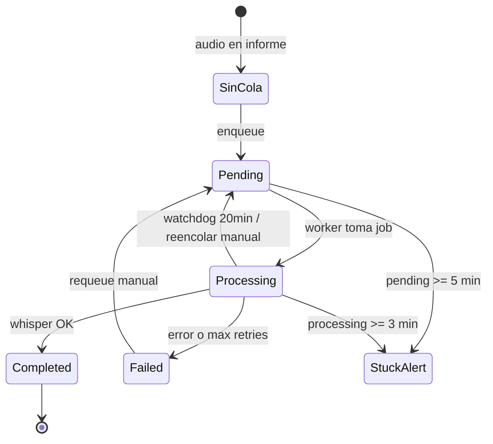

# Arquitectura de transcripción de audios

Documentación técnica del subsistema de transcripción automática con **whisper.cpp**.

---

## Resumen

La transcripción es **asíncrona**: al subir o finalizar un audio no se transcribe al instante; se encola en base de datos y un **worker PHP por cron** procesa un job por ejecución llamando a Whisper vía HTTP.

```
Subida / adjuntar / finalizar informe
        │
        ▼
  audios_informe (INSERT)
        │
        ▼ (si auto_transcribe_enabled)
  ai_transcription_queue  status=pending
        │
        ▼  cron cada minuto
  transcription-queue-worker.php
        │
        ├── ai_transcriptions  status=processing
        ├── WhisperClient → whisper-server o whisper-cli API
        └── al completar:
              ai_transcriptions  status=completed
              audios_informe.transcripcion_texto ← texto
              ai_transcription_queue  status=completed
```

---

## Componentes principales

| Archivo / servicio | Rol |
|--------------------|-----|
| `utils/WhisperClient.php` | Cliente HTTP hacia whisper.cpp (multipart, conversión ffmpeg si hace falta). Timeout default 600 s. |
| `workers/whisper-cli-api.js` | API Node alternativa cuando `whisper_method = whisper-cli` |
| `workers/transcription-queue-worker.php` | Procesador principal de cola (cron `* * * * *`) |
| `workers/transcription-watchdog.php` | Recuperación de jobs en `processing` > 20 min (cron sugerido cada 2 min) |
| `api/ai-informes.php` | API REST: cola, transcribe, blocked, queue-status, etc. |
| `api/audios/upload.php` | Subida + auto-encolado (excepto móvil en upload) |
| `api/audios/enqueue.php` | Encolado explícito (móvil al finalizar informe, batch); exige health OK/degraded |
| `api/informes/attach-audio.php` | Adjuntar audio a informe + encolar (omite cola si Whisper down) |
| `api/transcription_health.php` | Health check compartido (`ready` / `status`) |
| `components/workspace.html` | Llama a `enqueue.php` al finalizar informe con audios móviles |

Antes de encolar o procesar, el portal consulta `/health` del Whisper configurado en `ai_config`. El endpoint incluye información sobre el modo de operación (GPU/CPU) desde v2026.09. Detalle: [transcripcion-health-check.md](transcripcion-health-check.md).

---

## Tablas de base de datos

### `audios_informe`

- `transcripcion_texto` — texto visible en UI
- `activo`, `informe_id`, `estado` (p. ej. `en_papelera`, `listo_workspace`, `guardado_informe`, `enviado_transcripcion`)
- `fecha_modificacion` — se actualiza al completar TX

### `ai_transcription_queue`

| Campo | Descripción |
|-------|-------------|
| `status` | `pending`, `processing`, `completed`, `failed`, `cancelled` |
| `audio_id` | FK lógica a `audios_informe` |
| `retry_count` / `max_retries` | Reintentos (default max 3) |
| `started_at` / `completed_at` | Tiempos de procesamiento |
| `priority` | Mayor número = mayor prioridad |

### `ai_transcriptions`

| Campo | Descripción |
|-------|-------------|
| `status` | `pending`, `processing`, `completed`, `failed` |
| `transcription_text`, `whisper_response` (JSON segments) |
| `error_message`, `processing_time`, `model_used` |

### `ai_config`

- `auto_transcribe_enabled`, `max_concurrent_transcriptions` (default 1)
- `whisper_api_url`, `whisper_cli_api_url`, `whisper_method`, `whisper_model`, `whisper_timeout`
- `ffmpeg_rest_url`

---

## Puntos de encolado

| Origen | Condición |
|--------|-----------|
| `upload.php` | Auto-TX activa, no es subida móvil pendiente de finalizar |
| `attach-audio.php` | Tras guardar audio |
| `enqueue.php` | POST manual o desde workspace al finalizar |
| `ai-informes.php` action `add-to-queue` | UI AI Informes |
| `modules/audit-manager/api/audios-requeue-tx.php` | Reencolado por auditor |

**Audios móviles:** no se auto-transcriben en upload; esperan finalización del informe en workspace → `enqueue.php`.

---

## Worker: comportamiento clave

Archivo: `workers/transcription-queue-worker.php`

1. Respeta `max_concurrent_transcriptions` (si ya hay N en `processing`, sale).
2. **Recuperación stale:** jobs en `processing` ≥ **20 min** → reencola a `pending` o marca `failed` si agotó reintentos.
3. Toma 1 `pending` con backoff por `retry_count`: 0, 60, 180, 600, 1800 s.
4. Inserta `ai_transcriptions` en `processing`, llama `WhisperClient::transcribeAudio()`.
5. Éxito: actualiza tablas y copia texto a `audios_informe`.

Logs: `logs/transcription-queue-worker.log`

---

## Watchdog

Archivo: `workers/transcription-watchdog.php`

- Misma lógica de timeout 20 min en cola `processing`.
- Log: `logs/transcription-watchdog.log`

---

## Detección de bloqueos (UI / alertas)

| Mecanismo | Umbral | Ubicación |
|-----------|--------|-----------|
| `list-blocked-transcriptions` | `ai_transcriptions.processing` ≥ **3 min** | `api/ai-informes.php`, modal en `ai-informes.js` |
| Informes Manager (alertas columna Audios) | Cola `processing` ≥ **3 min**, cola `pending` ≥ **5 min**, o TX `processing` ≥ **3 min** | Ver doc dedicado |
| Worker / watchdog | Cola `processing` ≥ **20 min** | Recuperación automática |

Constantes en `api/informes/transcription_status_helpers.php`:

- `INFORMES_TX_STUCK_MINUTES` = 3
- `INFORMES_TX_PENDING_MINUTES` = 5

---

## Configuración Whisper

`WhisperClient.php` soporta:

- **whisper-server:** POST a `/api/transcribe`, `/v1/audio/transcriptions`, etc.
- **whisper-cli:** POST a `{whisper_cli_api_url}/api/transcribe`

Conversión de formatos (WebM, M4A, …) vía ffmpeg-rest o ffmpeg local.

---

## UIs que exponen estado TX

| Módulo | Qué muestra |
|--------|-------------|
| **ai-informes.js** | Badge cola global, modal transcripciones bloqueadas, polling 5 s |
| **audit-manager** | Columna `transcription_queue_status`, reencolar TX/FTP |
| **informes-manager** | Badges en columna Audios, polling 30 s, reintentar en modal |

---

## Cron recomendado

```bash
# Worker principal (cada minuto)
* * * * * php /var/www/tjsiddse/workers/transcription-queue-worker.php >> /dev/null 2>&1

# Watchdog (cada 2 minutos)
*/2 * * * * php /var/www/tjsiddse/workers/transcription-watchdog.php >> /dev/null 2>&1
```

Verificar con `api/ai-informes.php?action=check-cron`.

---

## Scripts de mantenimiento

| Script | Uso |
|--------|-----|
| `limpiar-transcripcion-bloqueada.php` | Limpieza manual de TX bloqueadas |
| `workers/add-existing-audios-to-queue.php` | Migración: audios sin TX a cola |
| `cleanup-blocked-transcriptions` (API) | Marca failed y limpia cola |

---

## Diagrama de estados (audio elegible)



---

*Última actualización: 2026-09-03*
